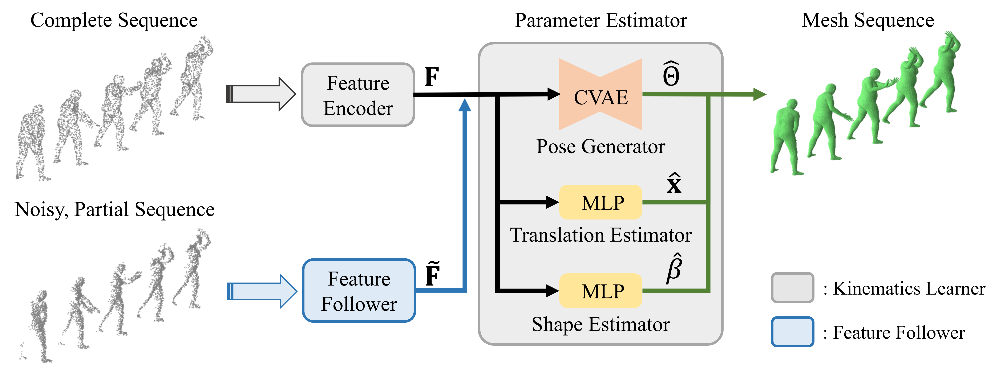

# DynamicMeshRecovery
Official Github repository for <b>Dynamic Mesh Recovery from Partial Point Cloud Sequence (ICCV 2023)</b> [[Paper]](https://openaccess.thecvf.com/content/ICCV2023/html/Jang_Dynamic_Mesh_Recovery_from_Partial_Point_Cloud_Sequence_ICCV_2023_paper.html) [[Video]](https://youtu.be/OgineYrkgRE?si=FK1sf5wmjFWmX90o)

<p align="center"></p>


## Installation
We use Anaconda3 for environment setup. We provide [yaml](./installation/motion_env.yaml) file for the installation or you can use the shell script given below.
```
./installation/setup_env.sh
```

## Dataset Preparation
### Human
First, download SMPL model from [here](https://smpl.is.tue.mpg.de/). You need to download `version 1.1.0 for Python 2.7 (female/male/neutral, 300 shape PCs)` as we use neutral body shape as a default.

After downloading SMPL model, you need to download [AMASS](https://amass.is.tue.mpg.de/index.html) dataset. We used all datasets given in AMASS, excluding the datasets without SMPL+H format (CNRS, WEIZMANN).

### Hand
Download MANO model from [here](https://mano.is.tue.mpg.de/) to handle hand parametric model. We will use `MANO_RIGHT.pkl` and `MANO_LEFT.pkl` model files.

After downloading MANO model, you need to download [HanCo](https://lmb.informatik.uni-freiburg.de/resources/datasets/HanCo.en.html) and [InterHand2.6M](https://mks0601.github.io/InterHand2.6M/) dataset.

### Preprocessing
TODO

For the full point cloud data, we sample the point clouds on the mesh surface.
```
# For human sequence
python ./data/preprocess_full_human.py

# For hand sequence
python ./data/preprocess_full_hand.py
```

For human synthetic partial point cloud data, we followed the method used in [VoteHMR](https://github.com/hanabi7/VoteHMR) which uses [SURREAL](https://github.com/gulvarol/surreal) dataset generation pipeline as a backbone.

* We will upload the partial point cloud preprocessing code using Open3D library later.

Follow the instructions of SURREAL and generate the partial point cloud sequence of human motions.
Make sure the `.npz` files are formed as below:
```
*.npz
├── body_pose [T, P]
├── body_shape [T, B]  <== [1, B] expanded
├── joints [T, J, 3]
├── points [T, N, 3]
├── partial_points [T, N', 3]
└── trans [T, 3]
```
We give an example `.npz` file [here](./data/human_partial_example.npz).

## Training
### 1. Train kinematic prior from full point cloud sequence
Batch number is set for 24GB VRAM GPUs.
```
python train.py --dataset [DATASET_NAME] --nbatch 32 --Ttot 40 --inputpc_size 1024 --pretrained_mode 0 --num_workers [NUM_WORKERS] --exp_name [EXPERIMENT_NAME]
```
### 2. Train to recover full mesh from partial point cloud sequence
Set <i>pretrained_pth</i> as the pretrained path file that is saved in step 1.
Batch number is set for 24GB VRAM GPUs.
```
python train.py --dataset [DATASET_NAME] --nbatch 24 --Ttot 40 --inputpc_size 1024 --pretrained_mode 1 --pretrained_pth [PRETRAINED_PRIOR_PTH] --exp_name [EXPERIEMNT_NAME]
```
## Evaluation
Set <i>pretrained_pth</i> as the pretrained path file that is saved in step 2.
```
python train.py --dataset [DATASET_NAME] --nbatch 32 --Ttot 40 --inputpc_size 1024 --pretrained_mode 2 --pretrained_pth [PRETRAINED_PRIOR_PTH] --exp_name [EXPERIEMNT_NAME]
```

## Bibtex
```bibtex
@InProceedings{Jang_2023_ICCV,
    author    = {Jang, Hojun and Kim, Minkwan and Bae, Jinseok and Kim, Young Min},
    title     = {Dynamic Mesh Recovery from Partial Point Cloud Sequence},
    booktitle = {Proceedings of the IEEE/CVF International Conference on Computer Vision (ICCV)},
    month     = {October},
    year      = {2023},
    pages     = {15074-15084}
}
```